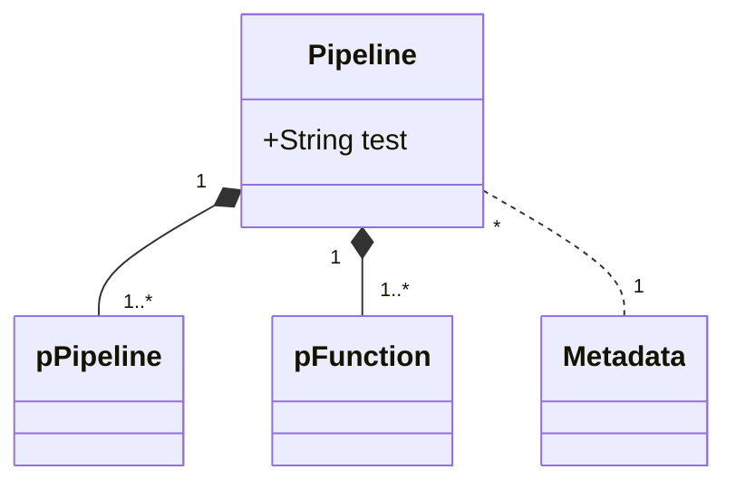

# Architecture

### Summary
### Table of Contents
1. [Defining Pipelines In Code](#1-defining-pipelines-in-code)
2. [Multithreading](#2-multithreading)

### Structures

**Branch**

**Metadata**

**Deployment**

**Runnable**

**Repository**

**Module**

**Function**

---

## 1. Building Pipelines

### 1.1 Deployments
### 1.2. Metadata

#### 1.2.a Generating Metadata with Branches

#### 1.2.b Generating Metadata with Repositories

### 1.3 Runnable

---

## 2. Running Pipelines