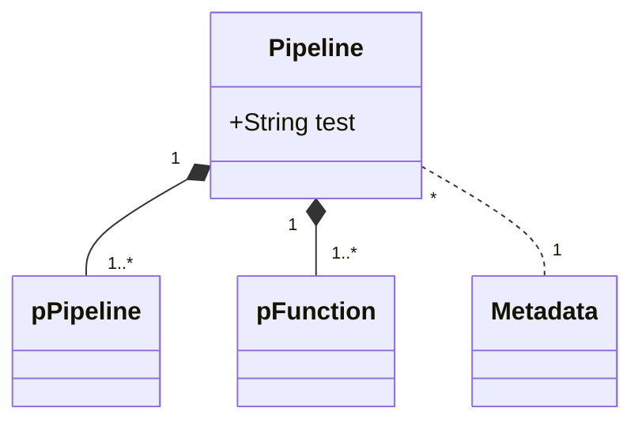

# Architecture

## Summary
## Table of Contents
1. [Defining Pipelines In Code](#1-defining-pipelines-in-code)
2. [Multithreading](#2-multithreading)

## Overview

The **Build** function is the entrypoint of the yule framework.
The caller invokes a **Build** function which transforms some input into an intermidiary representation that may be used to build a pipeline.

### Steps
1. Transform input into an intermediary representation.
2. Validate the intermediary representation.
3. Transform the intermediary representation into a Pipeline.
4. Return the **Pipeline** structure to the caller.

### Callable Functions
1. **Pipeline.Run()** is used to spin-up functions inside the **Pipeline**.
2. **Pipeline.Test()** is used as an integration test to validate the functionality of the **Pipeline**.

---

## Functions

---

### Build
**Build**
creates a pipeline based on the parameters passed by the caller.

#### Variants
There are three variants of the build function.

**(1) Build(funcA, funcB, ... , funcC)** takes a series of functions that will be executed in sequence.

Pros:
- Simplest way to build pipelines.
- Useful for describing linear pipelines.

Cons:
- Cannot describe non-linear pipelines.

**(2) Build(branchA, branchB, ... , branchC)** takes a series of branches to create execution graphs.

Pros:
- Can describe non-linear pipelines such as trees and graphs.

Cons:
- More complicated than passing functions.

**(3) Build(PipelineMetadata, Repository)** takes a JSON representation of an execution graph and a collection of
labelled golang functions to build an execution graph.

Pros:
- Provides an option to build execution graphs from a JSON representation.
- Can be useful for dynamically creating execution graphs during runtime.

Cons:
- Overhead of building an execution graph from an intermediary representation.
- The most complicated of the three build variants.

---

### Structures

#### Structure Relationships

**Branch**

**Metadata**

**Deployment**

**Runnable**

**Repository**

**Module**

**Function**

---

## 1. Building Pipelines

### 1.1 Deployments
### 1.2. Metadata

#### 1.2.a Generating Metadata with Branches

#### 1.2.b Generating Metadata with Repositories

### 1.3 Runnable

---

## 2. Running Pipelines